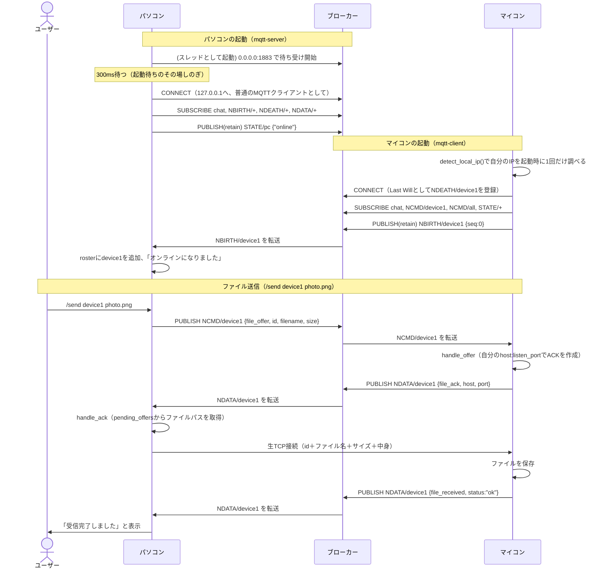

# mqtt-app

MQTTを使って、パソコン（指示役）とマイコン（従う役、Linux想定）が通信するサンプルです。
**1つのCargoプロジェクトから、`mqtt-server`（パソコン役）と`mqtt-client`（マイコン役）という
2つの実行ファイルを作る**構成になっています。

以前は`mqtt-server/`・`mqtt-client/`という完全に別々の2プロジェクトで作っていましたが
（このリポジトリにそのまま残っています）、メッセージ定義などの共通コードを2箇所に
コピーして持つことになり、直すときに両方直す必要があって面倒でした。このプロジェクトは
その反省を踏まえて、共通コードを1箇所（`src/lib.rs`以下）にまとめ直したものです。

> Rustを触ったことがない方（C++は経験がある方）向けに、コード中のコメントで
> Rust特有の概念をC++と対比しながら説明しています。まずは`src/lib.rs`の先頭にある
> 「Rustが初めての方（C++経験者向け）の予備知識」を読んでから、他のファイルを見ることを
> おすすめします。

## 登場人物

- **パソコン役**（`mqtt-server`実行ファイル）: MQTTブローカー（サーバー本体）と、
  指示出しロジック（チャット・ファイル送信・ジョブ配信）を1つのプロセスに同居させたもの。
  Windowsを想定しています。
- **マイコン役**（`mqtt-client`実行ファイル）: パソコンからの指示を受けて、ファイルを
  受信したりジョブを実行したりする側。Linuxを想定しています。

パソコンとマイコンは別々のOS・別々のマシンで動かすことを想定していますが、**このプロジェクト
自体はOSに依存しないコードだけでできている**ので、各マシンでこのリポジトリをcloneして、
自分に必要な方の実行ファイルだけをビルドすれば大丈夫です（クロスコンパイル環境は不要です）。

```sh
# Windows（パソコン役）側
cargo build --bin mqtt-server
cargo run --bin mqtt-server

# Linux（マイコン役）側
cargo build --bin mqtt-client
cargo run --bin mqtt-client
```

## 使い方

### コマンド一覧

起動後、キーボードから入力して`Enter`を押すことで使えるコマンドです（`Ctrl+D`で
入力用スレッドを終了できます）。詳しい説明は、この後の各節を参照してください。

| コマンド | 使える側 | publishするトピック（送信） | 応答として届くトピック（受信） |
|---|---|---|---|
| `<テキスト>`（プレフィックス無し） | パソコン・マイコン共通 | `<topic>`（QoS1、`{"type":...}`ではなく`<名前>: <テキスト>`という生の文字列） | なし |
| `/qos0 <テキスト>` | パソコンのみ | `<topic>`（QoS0） | なし |
| `/qos1 <テキスト>` | パソコンのみ | `<topic>`（QoS1、プレフィックス無しと同じ） | なし |
| `/qos2 <テキスト>` | パソコンのみ | `<topic>`（QoS2） | なし |
| `/send <宛先の名前> <ファイルパス>` | パソコンのみ | `<topic>/NCMD/<宛先の名前>`（`OfferMsg`） | `<topic>/NDATA/<宛先の名前>`から`file_ack`→（生TCPでファイル本体を送信した後）同じトピックから`file_received` |
| `/job <内容>` | パソコンのみ | `<topic>/NCMD/all`（`JobMsg`） | オンラインな**マイコンの数だけ**、それぞれの`<topic>/NDATA/<マイコン名>`から`job_done`（全員分揃うかタイムアウトまで待つ） |

マイコン役の入力用スレッドは、チャット発言（プレフィックス無し）専用です。`/send`・`/job`
に相当する処理は、マイコン側では**人間が打つコマンドではなく、パソコンから届いた
`OFFER`/`JOB`メッセージへの自動応答**として行われます（`src/device.rs`の
`handle_offer`・`handle_job`関数を参照）。

### パソコン役の起動

```sh
cargo run --bin mqtt-server -- [OPTIONS]

# 使い方の一覧を見る
cargo run --bin mqtt-server -- --help

# 例（すべて省略）
cargo run --bin mqtt-server

# 例（ポートと名前だけ指定。他は省略してデフォルトのまま）
cargo run --bin mqtt-server -- --port 1883 --name pc

# 例（MQTT通信ログをファイルへ書き出す）
RUST_LOG=mqtt_app=info cargo run --bin mqtt-server -- --log-file mqtt-server.log
```

| 引数 | 短縮形 | デフォルト |
|---|---|---|
| `--port <PORT>` | `-p` | `1883` |
| `--name <NAME>` | `-n` | `pc` |
| `--topic <TOPIC>` | `-t` | `chat` |
| `--log-file <PATH>` | `-l` | （標準エラー出力） |

全部省略可能で、コマンドライン引数の解析には`clap`クレートを使っています。
`--`の後に必要な引数だけを好きな順番で指定でき、`--port`のように省略形（`-p`）でも
指定できます。`--help`を付けて実行すると、この一覧が自動生成された形で表示されます。
`log-file`について詳しくは後述の「ログ出力」の節を参照してください。

起動すると、中で2つのことが順番に起きます。

1. まずMQTTブローカー（サーバー本体）が`0.0.0.0:<ポート番号>`で**待ち受けを始めます**。
   `0.0.0.0`は「このマシンが持っている、どのネットワークインターフェース（LANカード等）
   からの接続でも受け付ける」という意味の特別なアドレスで、**待ち受け専用**の書き方です
   （C++の`bind()`に`INADDR_ANY`を渡すのと同じです）。**「`0.0.0.0`という場所に繋ぎに行く」
   ということはできません**（誰からも見て「自分自身」を指す特殊な値なので、他のマシンからの
   接続先としては使えません）。
2. 続けてパソコン自身が、**同じマシン上で今起動したばかりのブローカーへ**、普通のMQTTクライアント
   として`127.0.0.1:<ポート番号>`（自分自身を指すアドレス）で接続します。

**なぜ`0.0.0.0`で待ち受けるのか**：1台のマシンは普通、複数のネットワークインターフェース
（`127.0.0.1`＝自分自身とだけ通信するループバックと、`192.168.1.20`のようなLAN向けアドレスなど）
を同時に持っています。`bind()`するときに特定の1つのアドレスだけを指定すると、**そのアドレス
経由で届いた接続しか受け付けなくなります**。今回のブローカーは、パソコン自身が`127.0.0.1`
経由で接続してくる（上記②）のと、別マシンのマイコンがLAN経由（`192.168.1.20`など）で
接続してくるのと、**両方を同時に受け付ける必要がある**ので、「どの経路からでも受け付ける」
`0.0.0.0`にする以外の選択肢がありません。

もちろん技術的には`broker.rs`の`listen`を特定のアドレス（例:`192.168.1.20`だけ）に絞ることも
可能で、実際「社内LANのインターフェースだけ受け付けて、それ以外（インターネット向けの
インターフェースなど）からは絶対に受け付けない」というセキュリティ目的で意図的に絞ることも
あります。ただしその場合、**パソコン自身の`127.0.0.1`経由の接続まで一緒に弾かれてしまう**ので、
今の「パソコンにブローカーとコントローラを同居させる」構成のままでは`0.0.0.0`のままにしておく
必要があります。

### マイコン役の起動

```sh
cargo run --bin mqtt-client -- --name <名前> --listen-port <ポート番号> [OPTIONS]

# 使い方の一覧を見る
cargo run --bin mqtt-client -- --help

# 例（パソコンと同じマシンで動作確認する場合）
cargo run --bin mqtt-client -- --name device1 --listen-port 9101
cargo run --bin mqtt-client -- --name device2 --listen-port 9102

# 例（別のマシンから、パソコン(192.168.1.20)のブローカーへ繋ぐ場合）
cargo run --bin mqtt-client -- --name device1 --listen-port 9101 --host 192.168.1.20

# 例（MQTT通信ログをファイルへ書き出す）
RUST_LOG=mqtt_app=info cargo run --bin mqtt-client -- --name device1 --listen-port 9101 --log-file mqtt-client.log
```

| 引数 | 短縮形 | 必須/デフォルト |
|---|---|---|
| `--name <NAME>` | `-n` | **必須** |
| `--listen-port <PORT>` | （無し） | **必須** |
| `--host <HOST>` | （無し） | `127.0.0.1` |
| `--port <PORT>` | `-p` | `1883` |
| `--topic <TOPIC>` | `-t` | `chat` |
| `--log-file <PATH>` | `-l` | （標準エラー出力） |

`--name`・`--listen-port`だけは必須で、指定し忘れると`clap`が「必須です」という
エラーを表示して終了します（マイコン役は必ずファイル受信用のTCP待ち受けを行うため、
`--listen-port`＝他のマイコンと重複しない番号、は省略できません）。それ以外は全部
省略可能です。`log-file`について詳しくは後述の「ログ出力」の節を参照してください。

**`host`は「パソコン」ではなく「MQTTブローカーの住所」を指定する引数です**（今回はパソコンが
ブローカーを兼ねているので、実質パソコンのアドレスと同じ値になります）。上の例のように
同じ1台のマシンで動作確認するだけなら`127.0.0.1`（自分自身を指す特別なアドレス）のままで
構いませんが、**別々のマシンで動かす本来の使い方をする場合は、マイコン側で`host`に
パソコンの実際のLAN内IPアドレス（`192.168.1.20`のような）を指定する必要があります**
（`127.0.0.1`は常に「これを実行しているマシン自身」を指すので、マイコン側で使うと
マイコン自身を指してしまい、パソコンには繋がりません）。

### このプロジェクトに出てくるアドレス一覧

「待ち受け（bind、他人からの接続を受け付ける側）」と「接続しにいく（connect、自分から
繋ぎにいく側）」を混同すると分かりにくいので、登場する住所を全部まとめておきます。
パソコンは実は**待ち受け1つ＋接続しにいく側2つ**、マイコンは**待ち受け1つ＋接続しにいく側1つ**
の、合計5つの住所が登場します。

| 誰 | 役割 | 何のための住所か | 決め方 |
|---|---|---|---|
| パソコン | 待ち受け（ブローカー） | マイコン・パソコン自身、双方からのMQTT接続を受け付ける | `0.0.0.0:<ポート>`固定（`broker.rs`）。ポート番号はmqtt-serverの`--port`引数（省略時`1883`） |
| パソコン | 接続しにいく側①（MQTTクライアント） | コントローラ自身が、同じマシンのブローカーへMQTTで接続する | `127.0.0.1:<ポート>`固定（`mqtt-server.rs`）。同じプロセス内なので常にループバック |
| パソコン | 接続しにいく側②（TCPクライアント） | ファイル送信時、申し出た相手のマイコンへ生TCPで接続しにいく | **CLI引数では指定しない**。マイコンからのACKメッセージに書かれている`host`/`port`を実行時にそのまま使う（`handle_ack`参照） |
| マイコン | 待ち受け（ファイル受信用TCPサーバー） | パソコンから送られてくるファイルを、生TCPで受け取る | `0.0.0.0:<listen_port>`（`mqtt-client.rs`）。`listen_port`はmqtt-clientの`--listen-port`引数（**必須、省略不可**） |
| マイコン | 接続しにいく側（MQTTクライアント） | ブローカーへMQTTで接続する | mqtt-clientの`--host`/`--port`引数（省略時`127.0.0.1`/`1883`）。別マシン運用時はパソコンの実LAN IPを指定する |

パソコンの「接続しにいく側②」だけ他と毛色が違うのは、**人間がCLI引数で決める住所ではなく、
MQTTでのOFFER/ACKのやり取りを通じて実行時に決まる住所**だからです。マイコン自身のIPは
`detect_local_ip()`（詳しくは`file_transfer.rs`参照）で調べたものをACKに乗せていますが、
これは**起動時に1回だけ**行っています（DHCPで既にIPが配布された後にこのプログラムを
起動する運用を前提にしているため、動いている最中にIPが変わることは想定していません。
もし動いている途中でIPが変わりうる環境で使うなら、OFFERを受け取るたびに調べ直す設計に
戻す必要があります）。

### 検討したが採用しなかった設計：パソコン⇔ブローカーの同一プロセス内直結（`rumqttd`のLink）

パソコンは実はブローカーと同じプロセスで動いているので、上の表の「接続しにいく側①」も
TCPソケットを使わず、`rumqttd`が提供する`Broker::link()`という**同一プロセス内で直結する
専用API**（`LinkTx`/`LinkRx`）に置き換えられないか検討しました。期待したメリットは、
同じプロセス内なのにTCPソケットを経由する無駄が無くなることと、`mqtt-server.rs`の
`thread::sleep(300ms)`（ブローカー起動待ちのその場しのぎ）が不要になることでした。

実際に依存クレート`rumqttd 0.20.0`のソース（`src/link/local.rs`）を確認したところ、
次の理由で見送りました。

1. **お手軽な`LinkTx::publish()`は、QoS::AtMostOnce・retain=falseに固定されている**
   （ソースコード上、値がハードコードされていて変更できません）。今回はパソコンの
   `STATE`（"online"）をretain=trueで送る必要があり、OFFER/JOBもQoS::AtLeastOnceで
   送っているため、そのままでは使えません。
2. QoS/retainを自分で指定できる低レベルな`send()`もありますが、これは`async fn`です
   （ただし中身を読むと実際には一度も`.await`していないので、フルの`tokio`ランタイム
   なしでも軽量に呼び出せそうではあります）。
3. **そもそも、パソコン⇔ブローカー間だけを直結しても、実は意味が薄いです**。MQTTの
   仕様では、ブローカーが購読者へ配信するQoSは`min(publishされたQoS, 購読者が指定した
   QoS)`で決まります（保証は実際にやり取りして初めて成立するものなので、両端のうち
   弱い方に合わせるしかない、という理屈です）。マイコンは実際のネットワーク越しの
   購読者なので、もしパソコン側のpublishをQoS::AtMostOnceに落としてしまうと、
   **マイコンがどれだけ高いQoSで購読していても、配信は常にAtMostOnceまで格下げされて
   しまいます**。パソコン⇔ブローカー間が同一プロセスで信頼できても、ブローカー⇔
   マイコン間は今まで通り本物の（不安定になりうる）ネットワークなので、そちらの
   保証を弱めるわけにはいきません。

結論として、**手軽な方法（`publish()`）はQoS/retainの制約で使えず、制約を回避できる
方法（`send()`）を使うくらいなら乗り換える旨味（お手軽さ）が無い**と判断し、パソコン
⇔ブローカー間も今まで通り普通のTCP接続（`rumqttc::Client`）のままにしています。

### 起動からファイル送信までの流れ（シーケンス図）

ここまでの説明を、実際の時系列に沿って1枚の図にまとめます。



ファイルの中身そのもの（「生TCP接続」の1行）だけが、ブローカーを経由しない唯一の
やり取りです。それ以外は全部MQTT（ブローカー経由）で行われています。

### チャット

行を入力してEnterを押すと`<名前>: <入力内容>`が`<topic>`にpublishされます
（デバッグ用の簡易機能。`Ctrl+D`で送信スレッドを終了できます）。パソコン役では入力行の
先頭に`/qos0 ` `/qos1 ` `/qos2 `を付けると、そのメッセージだけQoSを指定して送信できます。

### ファイル送信（パソコン役の`/send`コマンド）

```
/send <宛先の名前> <ファイルパス>

# 例
/send device1 ./photo.png
```

MQTTは大きなバイナリデータの配信には向いていないため、**ファイルの中身そのものはMQTTに乗せず、
別途つないだ生のTCPソケットで直接送受信**する方式にしています。

1. パソコンが `<topic>/NCMD/<宛先名>` トピックへ「このファイルを送りたい」という申し出(`OfferMsg`)をpublish
2. 宛先のマイコンが、自分の待ち受けアドレス（IP＋固定ポート）を `<topic>/NDATA/<自分の名前>`
   トピックへ`AckMsg`として返す（IPアドレスは起動時に1回だけ調べたものを使う。DHCPで
   配布された後に起動する運用を前提にしている）
3. パソコンがそのアドレスへ直接TCP接続し、`id`＋ファイル名＋サイズ＋中身の順に流し込む
4. マイコン側は受信が終わった（または途中で失敗した）ら、結果を `<topic>/NDATA/<自分の名前>`
   トピックへ`{"type": "file_received", "id": "...", "status": "ok", "size": 12345, "seq": 4}`としてpublishする

`<topic>/NDATA/+`はパソコン役がワイルドカード購読しているので、送信結果がその場の
画面で確認できます。生TCPでやり取りしているファイルの中身自体はMQTT上には一切現れませんが、
その転送結果（成功/失敗）だけは必ずMQTT側に反映される、という設計にしています。

### ジョブの一斉配信（パソコン役の`/job`コマンド）

```
/job <内容>

# 例
/job print A4x3
```

「今オンラインになっている全マイコンへジョブを配り、全員の完了報告が揃うまで待ってから次の
ジョブを送る」という直列実行を行うコマンドです（印刷ジョブキューのような用途を想定）。

- マイコンは接続時に自分の`NBIRTH`トピック（`<topic>/NBIRTH/<名前>`）へ接続通知をpublishし、
  異常切断時にはLast Willで自動的に`NDEATH`（`<topic>/NDEATH/<名前>`）が配信される。パソコンは
  これらをワイルドカード購読して「今どのマイコンがオンラインか」を動的な名簿として持っている
  （固定リストの設定は不要）
- `/job`実行時点でオンラインな全マイコンへ`<topic>/NCMD/all`にジョブをpublishし、
  各マイコンからの完了報告（`<topic>/NDATA/<マイコン名>`）が全員分揃うまで入力をブロックして待つ
- 一定時間（デフォルト10秒）応答が無いマイコンがいた場合は、そのマイコン名を挙げてエラー表示する

マイコン役は、ジョブを受け取ると（このサンプルでは実際の印刷は行わず）1秒待ってから完了報告を
返す、という簡易的な処理をします。実機では、この「1秒待つ」部分を実際の印刷やモーター制御など
の処理に置き換えることになります。

## ログ出力（MQTTのpublish/受信を確認する）

`[system]`で始まる行は、コマンドの結果など人間向けの表示です。それとは別に、**MQTTで
実際に何をpublish/受信したか**（トピック名とペイロードそのもの）を1行ずつログに出す
仕組みを`log`/`env_logger`クレートで用意しています（`src/mqtt_log.rs`参照）。

デフォルトでは何も表示されません。環境変数`RUST_LOG`で有効にします：

```sh
RUST_LOG=mqtt_app=info cargo run --bin mqtt-server
RUST_LOG=mqtt_app=info cargo run --bin mqtt-client -- --name device1 --listen-port 9101
```

```
[2026-09-06T03:40:28Z INFO  mqtt_app::mqtt_log] [MQTT送信] topic=chat/NCMD/device1 payload={"type":"file_offer","id":"pc-...","from":"pc","filename":"testfile.txt","size":15,"seq":0}
[2026-09-06T03:40:28Z INFO  mqtt_app::mqtt_log] [MQTT受信] topic=chat/NDATA/device1 payload={"type":"file_ack","id":"pc-...","host":"127.0.0.1","port":19041,"seq":0}
```

**`RUST_LOG=info`のように、クレート名を付けずに指定しないでください**。それだと依存
クレートである`rumqttd`（ブローカー本体）の内部ログまで大量に表示され、自分たちの
MQTT通信ログが埋もれてしまいます。`mqtt_app=info`のように**自分のクレート名だけ**を
指定するのがポイントです。

### ログをファイルへ書き出す

`mqtt-server`・`mqtt-client`はどちらも、**`--log-file`（`-l`）引数でログの出力先ファイル**を
指定できます（省略すればこれまで通り標準エラー出力に表示されます）。

```sh
RUST_LOG=mqtt_app=info cargo run --bin mqtt-server -- --log-file mqtt-server.log
RUST_LOG=mqtt_app=info cargo run --bin mqtt-client -- --name device1 --listen-port 9101 --log-file mqtt-client.log
```

`[system]`で始まる人間向けの表示（`println!`によるもの）はこれまで通り標準出力に
残り、`log`クレート経由のMQTT通信ログだけがファイルの方へ書き出されます（2つの出力先を
分けて使い分けられる、ということです）。指定したファイルが無ければ新規作成、既に
あれば中身を空にしてから書き込みます（`init_logger`関数、`src/mqtt_log.rs`参照）。

## プロジェクトの中身

```
mqtt-app/
├── Cargo.toml            … 2つの実行ファイル(mqtt-server, mqtt-client)と依存クレートの定義
├── README.md              … このファイル
└── src/
    ├── lib.rs             … 共通ライブラリのルート。Rust予備知識のまとめもここ
    ├── messages.rs        … MQTTでやり取りするメッセージの形（JSON）＝メッセージ一覧
    ├── seq.rs             … メッセージ欠落検知用のseq番号の仕組み
    ├── broker.rs          … MQTTブローカーの起動（mqtt-serverだけが使う）
    ├── controller.rs      … パソコン役の指示出しロジック（mqtt-serverだけが使う）
    ├── file_transfer.rs   … マイコン役の生TCPファイル受信（mqtt-clientだけが使う）
    ├── device.rs          … マイコン役のOFFER/JOB受信処理（mqtt-clientだけが使う）
    └── bin/
        ├── mqtt-server.rs … パソコン役の実行ファイルの入り口（main関数）
        └── mqtt-client.rs … マイコン役の実行ファイルの入り口（main関数）
```

`messages.rs`・`seq.rs`・`broker.rs`・`controller.rs`・`file_transfer.rs`・`device.rs`は
すべて`src/lib.rs`から`pub mod`で宣言されている**共有ライブラリのモジュール**で、
`src/bin/`以下の2つの実行ファイルの両方（または該当する片方）から`use mqtt_app::...`で
読み込まれます。以前の2プロジェクト構成と違い、共通コードは1箇所にしか存在しません。

## APIドキュメント（メッセージ一覧）の生成

ソースコード中の`///`・`//!`ドキュメントコメントから、ブラウザで見られるHTML形式の
ドキュメントを`cargo doc`（Rust標準のrustdoc）で生成できます。

```sh
cargo doc --no-deps --document-private-items --open
```

生成されたドキュメントのトップページから`messages`モジュールへ進むと、`OfferMsg`・`AckMsg`・
`ReceivedMsg`・`BirthDeathMsg`・`PresenceMsg`・`JobMsg`・`DoneMsg`という、MQTT上でやり取りする全メッセージの
一覧（各フィールドの説明コメント込み）が見られます。

## トピック構造とseq番号（Sparkplug Bを参考にした設計）

MQTTの正式な産業IoT向け規約であるSparkplug Bをそのまま採用するのは今回の規模では
大掛かりすぎるため、フル準拠はせず、その核となる考え方（**トピックの名前は常にそのノード
自身のチャンネルを表す**という設計と、**seq番号による欠落検知**）を取り入れています。

### 登場人物の対応：Edge Node / Device / Host Application

Sparkplug Bには3種類の役割があり、**「MQTTブローカーに自分で直接つないでいるかどうか」**で
どれに当たるかが決まります。

| Sparkplug Bの役割 | 特徴 | 本プロジェクトでの対応 |
|---|---|---|
| **Edge Node** | MQTTに**自分で直接接続**し、自分の状態を自分で`NBIRTH`/`NDATA`/`NDEATH`としてpublishする。コマンド(`NCMD`)を受け取る側 | **マイコン**（`mqtt-client`が自分でブローカーへ接続し、自分の名前で報告している） |
| **Device** | MQTT接続を**持たない**末端機器（Modbusのセンサーなど）。Edge Nodeが代わりに`DBIRTH`/`DDATA`を代理publishする | 本プロジェクトには無し（マイコンは全部自分でMQTT接続を持つので、代理publishされる存在はいない） |
| **Host Application** | 全Edge Node/Deviceをワイルドカード購読して監視し、コマンドを出す「監督者」。自分の生死は専用の1本のトピック（`spBv1.0/STATE/<host_id>`）だけで知らせる | **パソコン**（`<topic>/NBIRTH/+`・`<topic>/NDEATH/+`・`<topic>/NDATA/+`で全マイコンを監視し、`NCMD`でOFFER/JOBの指示を出す。自分の生死は`<topic>/STATE/<自分の名前>`で知らせる） |

「エッジ（現場に近い）」という一般的な語感からパソコンをEdge Nodeだと思ってしまいがちですが、
Sparkplug Bでの判定基準はあくまで「MQTT接続を自分で持っているか」です。マイコンは自分で
ブローカーに接続して自分の状態を報告しているのでEdge Node、パソコンは全員を監視して指示を
出すだけなのでHost Applicationに当たります。

### トピック構造：Sparkplug Bのmessage_type名をそのまま使う

トピックは`<topic>/<message_type>/<マイコンの名前>`という形で、`message_type`には
Sparkplug B本家の名前をそのまま使っています（全マイコンへの一斉配信だけは特別に名前の
部分に`all`を使います）。

これは本家Sparkplug Bのトピック（`spBv1.0/<group_id>/<message_type>/<edge_node_id>/
[device_id]`）を、抽象的な自作の種別名（`cmd`/`data`）に置き換えず、そのまま採用した形です。
ポイントは3つあります。

1. **種別（`message_type`）が名前より先に来る**：本家の`.../<message_type>/<edge_node_id>`
   の順に合わせています。
2. **本家は「起動・終了の通知」と「動作中の継続的な報告」を別のmessage_typeに分けている**：
   `NBIRTH`（接続した）・`NDEATH`（切断した）と、`NDATA`（動作中のデータ更新）は別物です。
   一方`NCMD`（命令）は、命令の具体的な内容ごとにトピックを分けたりしません。**本家でも
   「リブートして」も「出力を書き換えて」も全部同じ`NCMD`トピックに、中身（メトリクス）が
   違う値として乗ります**。つまり`NCMD`は元から抽象的な箱で構わない、という設計です。
3. **名前が付いたトピックは、常に「その名前の持ち主自身の持ち物」**：ホストが`NCMD`を
   送るのは「そのノードへ命令する」という意味、ノード自身が`NBIRTH`/`NDATA`/`NDEATH`を
   送るのは「自分について報告する」という意味で、**「誰が発行するか（＝メッセージの向き）」
   はメッセージ種別だけで決まり、名前はいつも同じ意味（その持ち主自身）**という設計に
   なっています（以前の版で「名前がトピックによって宛先だったり送信者自身だったりして
   分かりにくい」という指摘を受けたので、この考え方に倣って作り直しました）。

- `<topic>/NCMD/<名前>` … ホスト（パソコン）が、名前のマイコンへ向けて送る命令。
  `OfferMsg`（ファイル送信の申し出）が乗る
- `<topic>/NCMD/all` … ホストが、全マイコンへ一斉配信する命令。`JobMsg`が乗る
  （`"all"`は「全員」を表す特別な名前で、実在するマイコン名ではない）
- `<topic>/NBIRTH/<名前>` … 名前のマイコンが接続した（起動した）ことの通知。
  起動時に1回だけretainでpublishする
- `<topic>/NDEATH/<名前>` … 名前のマイコンが切断した（終了した）ことの通知。
  Last Willとしてあらかじめ内容を登録しておき、実際の送信はブローカーが代理で行う
- `<topic>/NDATA/<名前>` … 名前のマイコンからの、動作中の継続的な報告。
  `AckMsg`・`ReceivedMsg`・`DoneMsg`の3種類がここに乗る
- `<topic>/STATE/<名前>` … 名前のパソコン自身が、自分の生死を報告するデータ
  （Sparkplug Bの`STATE`そのもの）。中身は`PresenceMsg`

**なぜ`+`や`#`のワイルドカードで「全員」を表さないのか**: ワイルドカードは
**購読(subscribe)専用の機能**で、送信(publish)には使えない、というのがMQTTの仕様上の
制約だからです。`client.publish("chat/NCMD/+", ...)`のような送信はプロトコル違反として
ブローカーに拒否されます。パソコンが「全員に届く1本の、実在する具体的なトピック名」に
publishする必要があるため、`all`という実在の名前を約束事として用意し、全マイコンに
あらかじめこれも購読させています（ネットワークでいうブロードキャストアドレスに近い発想です）。

`NBIRTH`/`NDEATH`はトピック自体が意味（オンライン/オフライン）を語るので、ペイロードは
`seq`だけの`BirthDeathMsg`です。一方`NCMD`/`NDATA`は複数種類のメッセージが同じトピックに
乗るので、JSON自身に`"type"`フィールドを持たせて中身を区別しています（`messages.rs`の
`CmdMsg`・`DataMsg`という`enum`。C++でいう`std::variant`やタグ付きunionに近いものです。
`STATE`トピックだけは乗るメッセージが`PresenceMsg`の1種類しか無いので、こうした`enum`で
包んでいません）。

| トピック | 乗るメッセージ（`"type"`） | 送信元→送信先 | ペイロード（JSON） |
|---|---|---|---|
| `<topic>/NCMD/<名前>` | `"file_offer"` | パソコン → 名指しした1台のマイコン | `{"type":"file_offer","id","from","filename","size","seq"}` |
| `<topic>/NCMD/all` | `"job"` | パソコン → 全マイコンへの一斉配信 | `{"type":"job","id","from","content","seq"}` |
| `<topic>/NBIRTH/<名前>` | （包まず`BirthDeathMsg`そのまま） | マイコン → 見ている全員 | `{"seq"}` |
| `<topic>/NDEATH/<名前>` | （包まず`BirthDeathMsg`そのまま） | マイコン → 見ている全員 | `{"seq"}` |
| `<topic>/NDATA/<名前>` | `"file_ack"` | マイコン → 見ている全員 | `{"type":"file_ack","id","host","port","seq"}` |
| `<topic>/NDATA/<名前>` | `"file_received"` | マイコン → 見ている全員 | `{"type":"file_received","id","status","size","seq"}`（`status`は`"ok"`か`"failed"`） |
| `<topic>/NDATA/<名前>` | `"job_done"` | マイコン → 見ている全員 | `{"type":"job_done","id","seq"}` |
| `<topic>/STATE/<名前>` | （包まず`PresenceMsg`そのまま） | パソコン → 見ている全員 | `{"status","seq"}`（`status`は`"online"`か`"offline"`） |

各フィールドの型や意味は`src/messages.rs`（`OfferMsg`・`JobMsg`・`AckMsg`・`ReceivedMsg`・
`DoneMsg`・`BirthDeathMsg`・`PresenceMsg`構造体、およびそれらをまとめる`CmdMsg`・`DataMsg`）に
コメント付きで定義されています。`cargo doc`で生成したドキュメントの`messages`モジュールでも
同じ内容が見られます。

マイコン側は自分の名前が付いた`NCMD`トピック（＋`NCMD/all`）だけを購読すればよく、他のマイコン
宛てのOFFERを気にする必要がありません。パソコン役は`<topic>/NBIRTH/+`・`<topic>/NDEATH/+`・
`<topic>/NDATA/+`とワイルドカード購読すれば、全マイコンの状態と報告をまとめて拾えます。
マイコン役も同様に`<topic>/STATE/+`をワイルドカード購読して、パソコンの生死を知ることができます。

なお、宛先・送信者の名前がすでにトピックで分かるようになったぶん、以前の版にあった
`OfferMsg.to`・`AckMsg.from`・`ReceivedMsg.who`・`DoneMsg.who`のような重複フィールドは
無くしました（同じ情報をトピックとペイロードの両方に持たせない、という設計です）。

**注意（`STATE`トピックの限界）**: マイコン側の`NDEATH`（LWT）は、ブローカーとマイコンが
別プロセスなので正しく機能します（マイコンが死んでもブローカーは生きていて、代わりに
`NDEATH`をpublishしてくれる）。一方パソコン側は、**ブローカーとコントローラ（パソコン役）が
同じプロセス**で動いているため、パソコンのプロセスが異常終了するとブローカー自体も同時に
落ちてしまい、「ブローカーが代わりにLast Willをpublishする」チャンスが無いまま接続自体が
切れることがあります（実際に動作確認したところ、マイコン側はLWTの"offline"ではなく、
MQTT接続そのものの切断エラーとして気付きました）。`"online"`の通知自体は正しく届くので
無駄な機能ではありませんが、この非対称性は今の「パソコンにブローカーとコントローラを同居させる」
構成による制約として理解しておいてください（ブローカーを独立したプロセス/マシンに分離すれば、
本家Sparkplug Bと同じようにこのLWTも正しく機能するようになります）。

### seq番号：メッセージの欠落検知

各メッセージには`seq`（連番）フィールドがあり、送信側は自分がpublishするたびに1つずつ
増やします。受信側は前回見た値と比べて1つも増えていなければ、「間の1通が抜けたかもしれない」
と警告を表示します（`seq.rs`の`check_seq`関数）。

**重要な注意点**: seqカウンタは**トピックごとに別々**に用意しています（`ControllerSeqState`・
`DeviceSeqState`構造体）。理由は、あるトピックを購読している人には、そこに流れるメッセージが
（中身の種類が違っても）必ず全部見えるはずだからです。例えば`<topic>/NDATA/<名前>`には
ACK・RECEIVED・DONEの3種類が乗りますが、同じトピックである以上、観測者からは必ず全部見えるので、
1本のカウンタ（`data_counter`/`data_tracker`）でまとめて欠落検知できます（これはSparkplug B
本家が「ノード1つにつきseqは1系列」としている設計にも合わせた形です）。逆に、別のトピックへ
流れるメッセージ（例えば他のマイコン宛ての`<topic>/NCMD/他の名前`）は見えないので、それを
同じカウンタに混ぜてしまうと、番号が「飛んで」見えてしまい、実際は何も欠落していないのに
誤って警告が出てしまいます（もともとの2プロジェクト構成での実装中に、実際にこの誤検知が
起きたことがあります）。

具体的には5系統のトピックに対応する5系統のカウンタ/トラッカーを用意しています。
`<topic>/NCMD/<名前>`（OFFER。宛先ごとに別トピック）、`<topic>/NCMD/all`（JOB。全マイコン
共通の1トピック）、`<topic>/NBIRTH/<名前>`＋`<topic>/NDEATH/<名前>`（接続・切断。合わせて1本の
カウンタ/トラッカーで管理）、`<topic>/NDATA/<名前>`（ACK・RECEIVED・DONEをまとめた1トピック）、
`<topic>/STATE/<名前>`（パソコンの生死。パソコンごとに別トピック）の5つです。パソコン役は
「OFFER・JOBを送る側」「各マイコンのNBIRTH/NDEATH/NDATAを受け取る側」「自分のSTATEを送る側」、
マイコン役はちょうど逆の組み合わせ（＋各パソコンのSTATEを受け取る側）なので、
`ControllerSeqState`・`DeviceSeqState`にはそれぞれが実際に使うカウンタ/トラッカーだけを
持たせています。

`NBIRTH`（Sparkplug BでいうBIRTH）を受け取ったときだけは、再接続でseqが0から数え直されるのが
正常な動きなので、警告を出さずにカウンタをリセットする扱いにしています。パソコンのSTATEの
`"online"`も同様です。

## MQTTペイロードの形式（JSON）

チャット本文（`<名前>: <内容>`という自由なテキスト）を除く、構造化されたメッセージは
すべて`serde`/`serde_json`を使って**JSON形式**でやり取りしています（`messages.rs`参照）。
JSONなら各フィールドに名前が付くので、後方互換を保ちながら項目を追加しやすく、
`mosquitto_sub`などで覗いたときも人間に読みやすいです。

なお、生TCPで送るファイル本体（`controller.rs`の`send_file_to`、`file_transfer.rs`の
`receive_one_file`）は今まで通りバイナリの長さプレフィックス形式のままです。ファイルの
生バイトをJSONに埋め込むと単純に非効率（Base64化でサイズが約1.33倍に膨らむ）なので、
そこは意図的にJSON化していません。

## MQTTの仕様と、それを使ってできること

起動時に指定する`<名前>`や`topic`は、このサンプル独自のものではなく、MQTTプロトコル自体が
定義している概念です。

### クライアントID（`<名前>`）

MQTT接続時に必須のID。ブローカーはこれで各クライアントを識別します。
**同じIDで同時に2つ接続すると、後から接続した方が優先され先勝ちの接続が切断される**という
仕様があるため、複数端末で試すときは必ず別々の名前を付けてください。

### トピック（`topic`）

`chat`のような文字列で、パブリッシュ（送信）とサブスクライブ（受信）を結びつけるための
「宛先」です。`/`区切りで階層構造にできるのがMQTTの特徴です。

### ワイルドカード購読（`+`と`#`）

サブスクライブ時だけ使える特殊な記号で、複数トピックをまとめて購読できます。

- `+`：1階層だけにマッチ。例: `chat/+`は`chat/room1`や`chat/room2`にマッチ
- `#`：それ以降の全階層にマッチ（末尾にのみ指定可）

パソコン役は`<topic>/NDATA/+`のように、全マイコン分をまとめて観測するのにこの
ワイルドカードを使っています。マイコン役も`<topic>/STATE/+`で、パソコンの生死を
同じ仕組みで観測しています。

### QoS（配信保証レベル）

MQTTにはQoS0（最大1回・送りっぱなし）/ QoS1（最低1回・重複あり得る）/ QoS2（正確に1回）の
3段階があります。確実に届けたい用途ならQoS1/2に、多少落ちてもいい大量データならQoS0に、
と使い分けます。
